# Dataplane Architecture Documentation

## Overview

Dataplane is a high-performance data pipeline orchestration platform built with Go and React. It provides drag-and-drop pipeline building, distributed task execution, secrets management, and multi-environment support.

## System Architecture

### High-Level Architecture

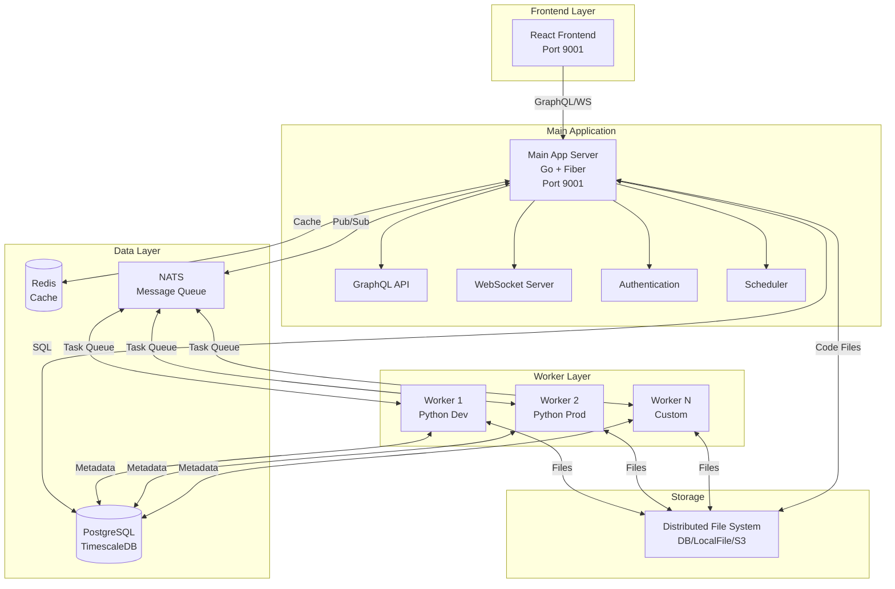

## Core Components

### 1. Main Application Server

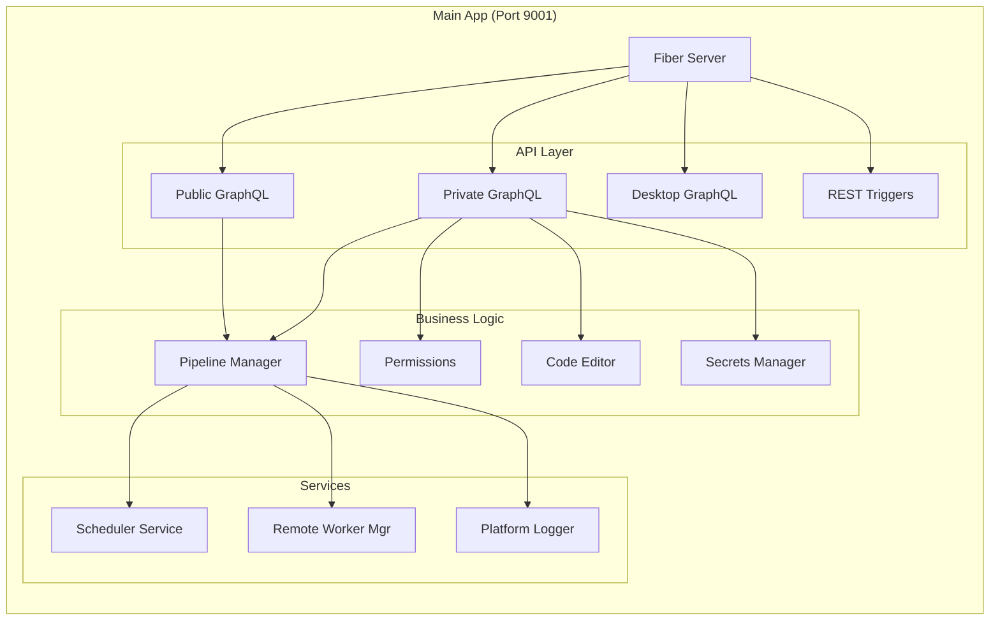

**Responsibilities:**
- GraphQL API serving (public, private, desktop variants)
- REST API for external pipeline triggers
- WebSocket connections for real-time updates
- User authentication and authorization
- Pipeline orchestration and scheduling
- Code editor backend
- Secrets management
- Static file serving for React frontend

**Technology:**
- Go with Fiber web framework
- gqlgen for GraphQL
- JWT authentication
- WebSocket for real-time updates

### 2. Worker System

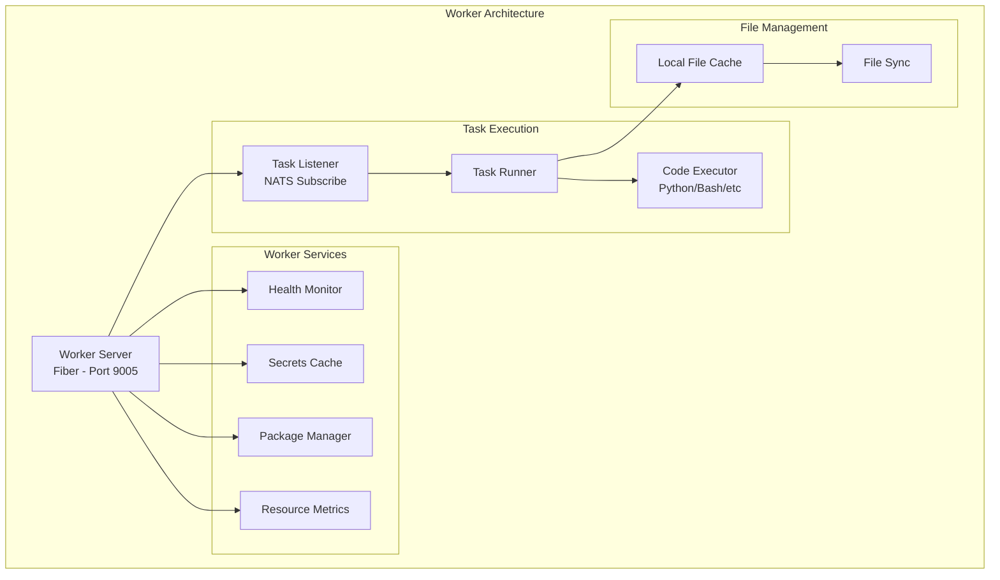

**Responsibilities:**
- Execute pipeline tasks (Python, Bash, etc.)
- Manage code packages and dependencies
- Monitor resource usage (CPU, memory)
- Cache code files locally
- Report health status
- Handle secrets securely
- Stream execution logs

**Worker Types:**
- VM workers (virtual machine execution)
- Container workers (Docker containers)
- Process workers (direct process execution)

**Worker Groups:**
- Environment-specific (Development, Production, Staging)
- Language-specific (Python, Go, etc.)
- Custom worker groups per use case

### 3. Communication Layer

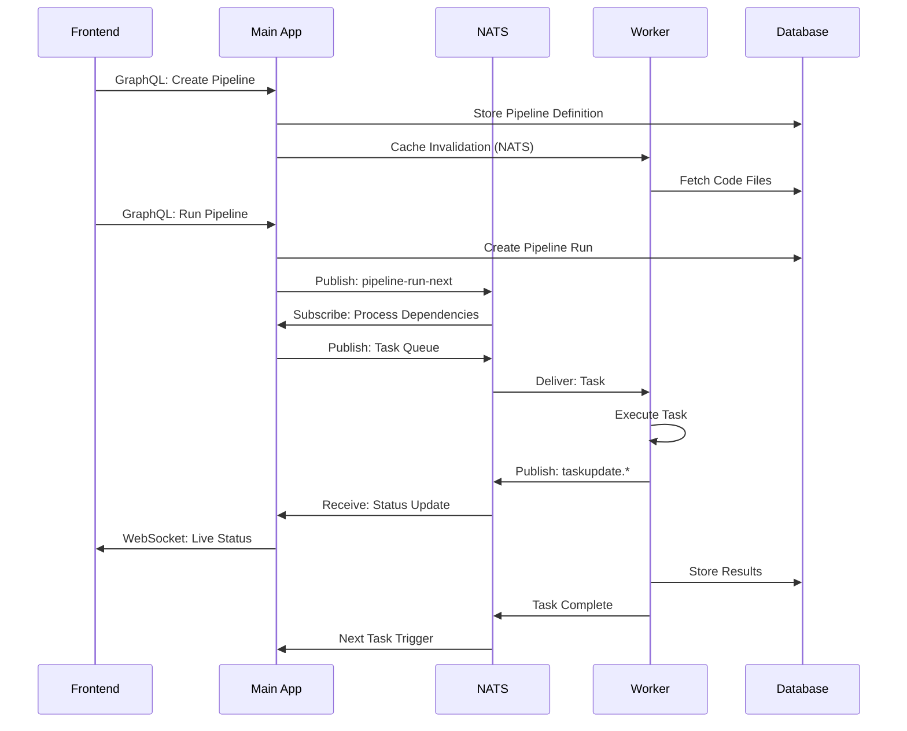

**Communication Patterns:**

1. **Frontend ↔ Main App:**
   - GraphQL for data operations
   - WebSocket for real-time updates
   - REST API for external triggers

2. **Main App ↔ Workers:**
   - NATS for task distribution
   - WebSocket for remote workers
   - Database for metadata sync

3. **Main App ↔ Data Layer:**
   - PostgreSQL for persistent storage
   - Redis for caching and sessions
   - NATS for pub/sub messaging

### 4. Data Layer Architecture

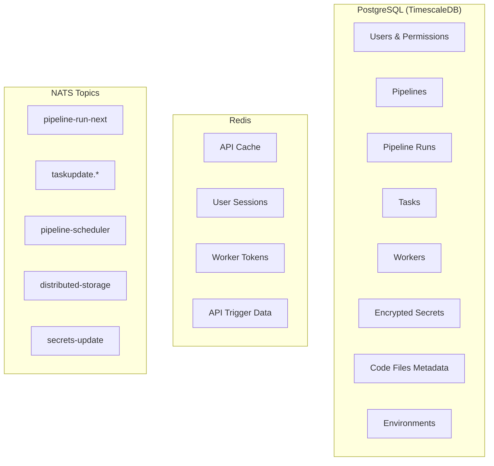

**Database Schema (Key Tables):**
- `users`: User accounts and authentication
- `permissions`: Fine-grained access control
- `environments`: Development, Production, etc.
- `pipelines`: Pipeline definitions and configurations
- `pipeline_runs`: Execution instances
- `tasks`: Individual task executions
- `workers`: Worker registration and health
- `code_files`: Code and file storage
- `secrets`: Encrypted secret values
- `deployments`: Version deployments

## Pipeline Execution Flow

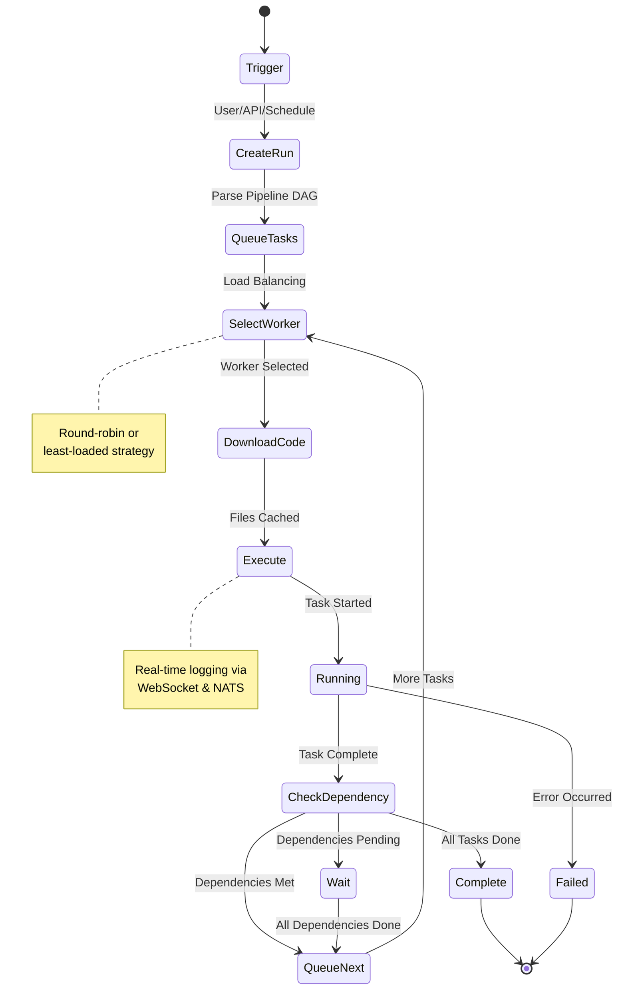

### Pipeline Execution Steps

1. **Trigger**: Pipeline started via UI, API, or scheduler
2. **Task Creation**: Pipeline nodes converted to executable tasks
3. **Dependency Resolution**: Task graph analyzed for execution order
4. **Queue Management**: Tasks queued to appropriate worker groups
5. **Worker Selection**: Load balancer assigns tasks to workers
6. **File Distribution**: Code files downloaded to worker cache
7. **Execution**: Worker executes task with environment and secrets
8. **Status Updates**: Real-time progress via NATS and WebSocket
9. **Dependency Check**: Next tasks triggered when dependencies complete
10. **Completion**: Results stored, notifications sent

## Distributed File System

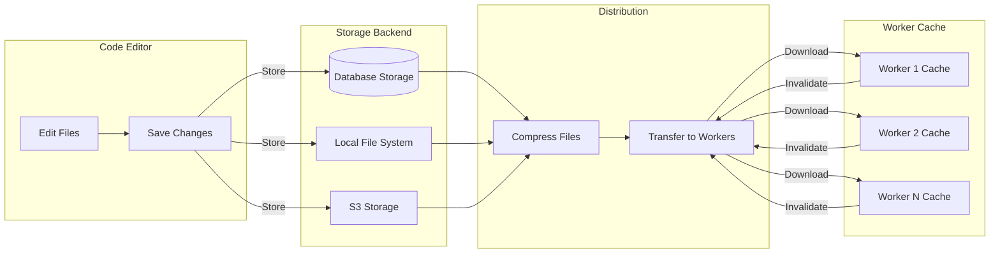

**Features:**
- **Storage Options**: Database, Local File System, S3
- **Caching**: Node-level file caching with automatic invalidation
- **Compression**: Files compressed before transfer
- **Versioning**: Version control for code deployments
- **Multi-Environment**: Separate file spaces per environment

## Authentication & Authorization

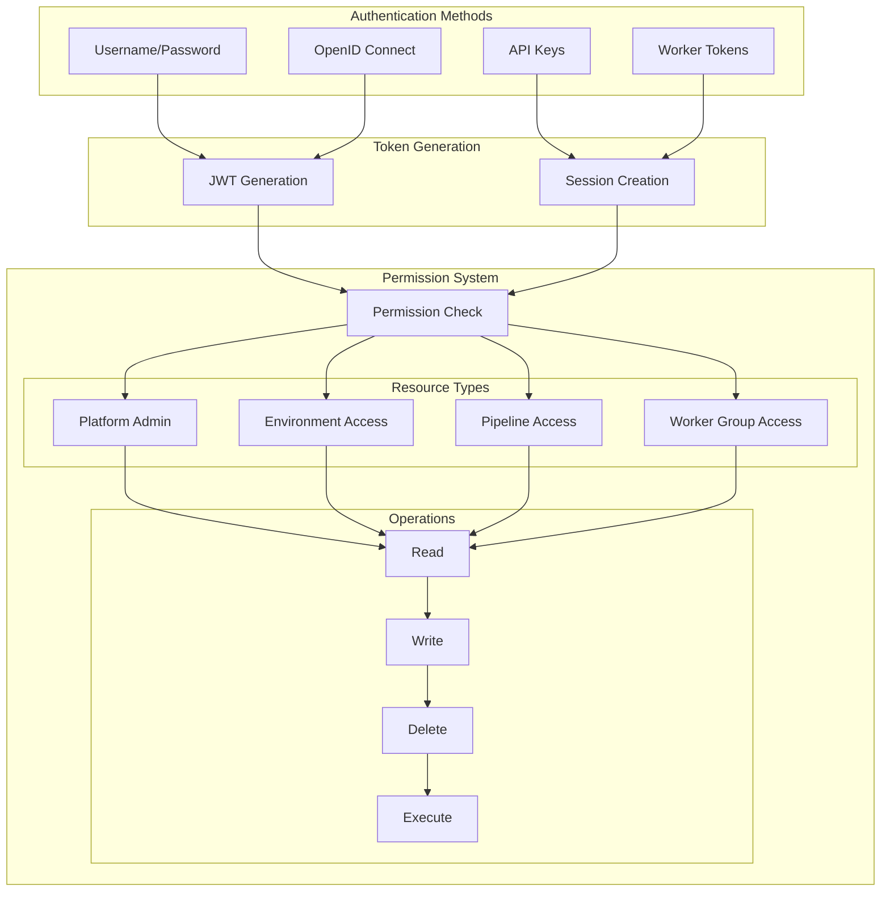

**Security Layers:**

1. **Authentication:**
   - JWT tokens for web sessions
   - API keys for external integrations
   - OpenID Connect for enterprise SSO
   - Session tokens for remote workers

2. **Authorization:**
   - Platform-level permissions (admin access)
   - Environment-level permissions (dev/prod isolation)
   - Pipeline-level permissions (specific pipeline access)
   - Resource-based access control

3. **Secrets Management:**
   - AES encryption with platform keys
   - Environment-scoped secrets
   - Secure injection to workers
   - No plaintext storage
   - Log redaction

## Scheduler System

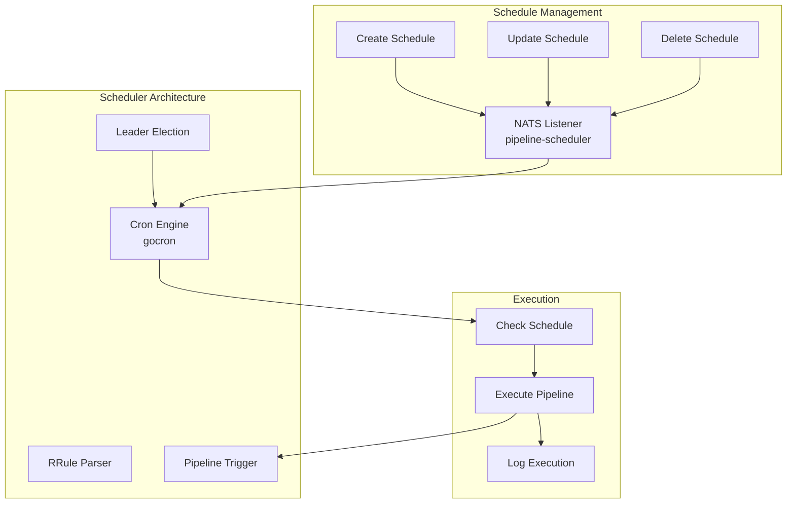

**Features:**
- RRule-based recurring schedules
- Multi-timezone support
- Dynamic schedule updates via NATS
- Leader election (single active scheduler)
- Cron expression support
- Schedule versioning per deployment

## Worker Health Monitoring

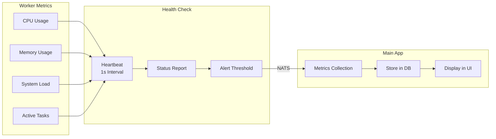

**Monitoring Capabilities:**
- Real-time resource metrics (CPU, memory, load)
- Task execution tracking
- Worker availability status
- Heartbeat monitoring (1-second intervals)
- Historical metric storage
- Alert thresholds

## Technology Stack

### Backend
- **Language**: Go 1.x
- **Web Framework**: Fiber (FastHTTP-based)
- **GraphQL**: gqlgen (schema-first)
- **Database ORM**: GORM
- **Message Queue**: NATS
- **Cache**: Redis
- **Authentication**: JWT
- **Scheduler**: gocron

### Frontend
- **Framework**: React
- **Communication**: GraphQL + WebSocket
- **Build**: Embedded static files

### Infrastructure
- **Database**: PostgreSQL with TimescaleDB
- **Cache**: Redis 7
- **Message Queue**: NATS 2.9
- **Containers**: Docker

### Worker Runtimes
- Python (primary)
- Bash
- Custom language support

## Deployment Architecture

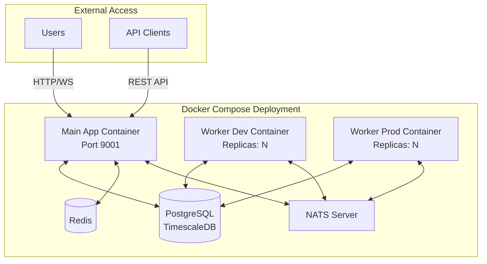

**Deployment Options:**
- **Docker Compose**: Quick start and development
- **Kubernetes**: Production scalability
- **Distributed Mode**: Multi-node deployment
- **High Availability**: Multiple replicas per component

## Interactive Flow: Creating and Running a Pipeline

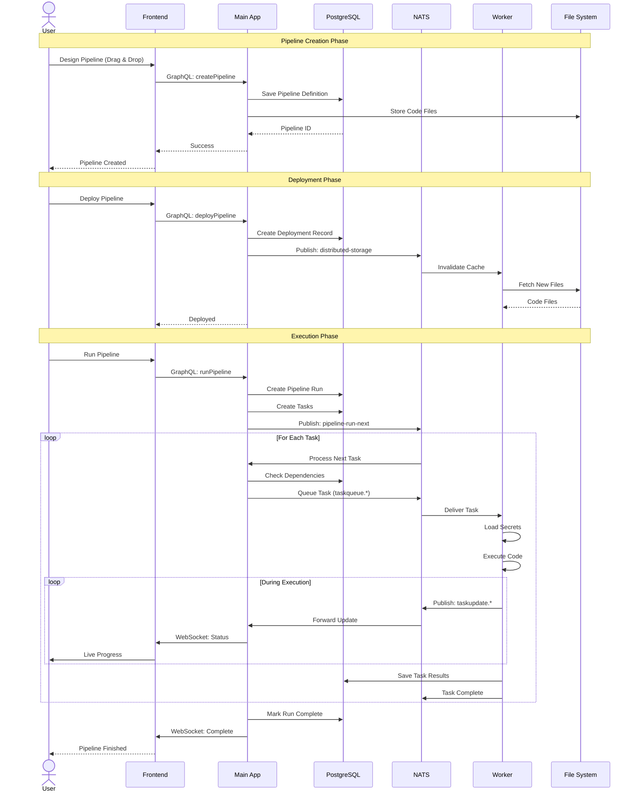

## Key Design Patterns

### 1. Event-Driven Architecture
- NATS pub/sub for asynchronous communication
- Real-time WebSocket updates
- Decoupled component interaction

### 2. Distributed Task Queue
- NATS-based task distribution
- Load balancing across workers
- Automatic retry and failure handling

### 3. Caching Strategy
- Redis for API-level caching
- Worker-level file caching
- Distributed cache invalidation

### 4. Multi-Tenancy
- Environment-based isolation
- Resource-level permissions
- Separate deployment spaces

### 5. Microservices Communication
- Message queue for async operations
- REST/GraphQL for synchronous calls
- WebSocket for real-time data

## Scalability Considerations

### Horizontal Scaling
- **Workers**: Add more worker containers/VMs
- **Main App**: Multiple instances with load balancer
- **Database**: PostgreSQL replication
- **NATS**: NATS clustering

### Vertical Scaling
- Increase worker resources for heavy workloads
- Scale database for larger datasets
- Expand Redis cache size

### Performance Optimization
- Worker file caching reduces I/O
- Redis caching reduces database load
- NATS messaging enables async processing
- Compiled Go code for high performance

## Monitoring and Observability

### Metrics Collected
- Worker CPU, memory, load
- Task execution times
- Pipeline success/failure rates
- Active connections
- Message queue depth

### Logging
- Structured logging with levels
- Real-time log streaming via WebSocket
- Log retention policies
- Secret redaction in logs

### Health Checks
- Worker heartbeat monitoring
- Database connection health
- NATS connectivity
- Redis availability

## Conclusion

Dataplane implements a robust, scalable architecture for data pipeline orchestration. Key strengths include:

- **Performance**: Go-based for low latency and high throughput
- **Scalability**: Distributed worker architecture with horizontal scaling
- **Security**: Multi-layered authentication and encrypted secrets
- **Real-time**: WebSocket and NATS for live updates
- **Flexibility**: Multi-environment support and custom worker groups
- **Reliability**: Comprehensive health monitoring and error handling

The architecture supports enterprise requirements including multi-tenancy, role-based access control, audit logging, and high availability deployment patterns.
